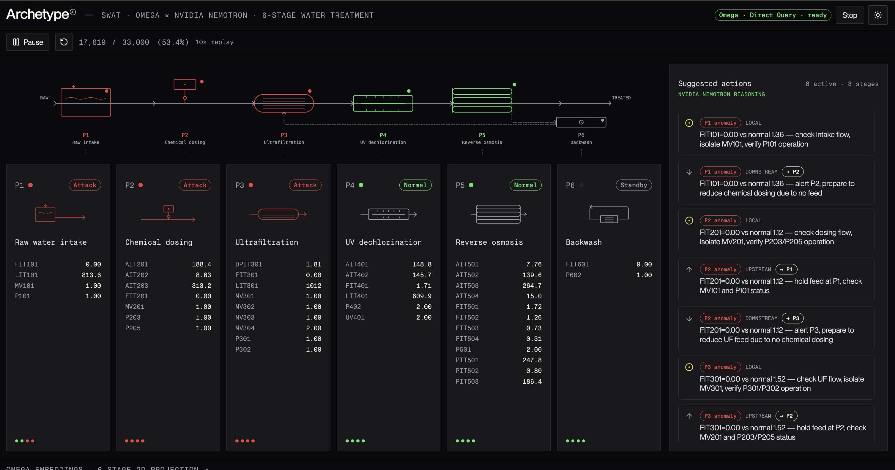
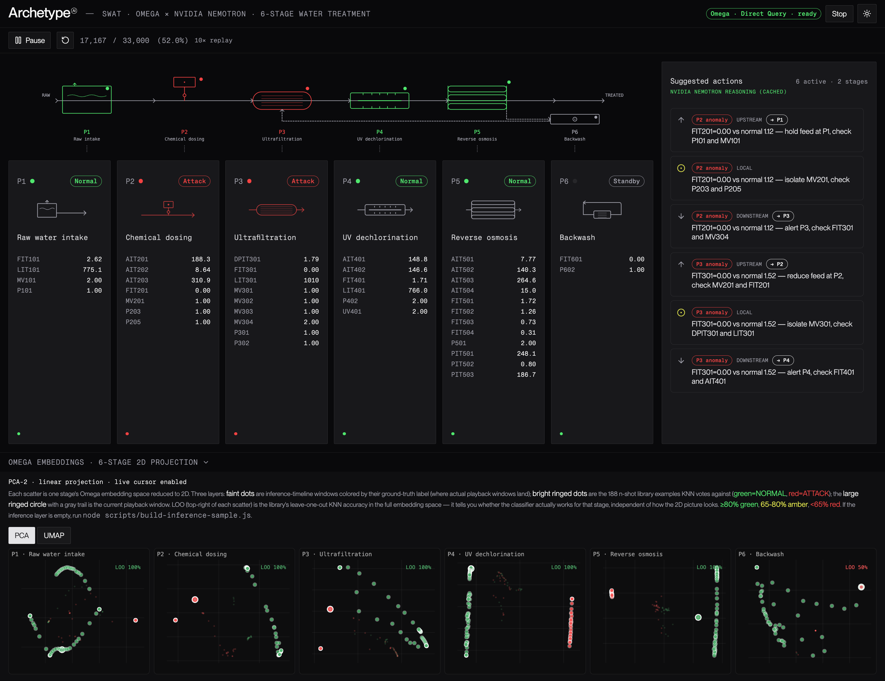

# archetypeai-swat-demo-nemotron



SWaT water-treatment demo pairing **Archetype AI Newton Omega** with **NVIDIA Nemotron**:

- **Sensing — Newton Omega** (Archetype Direct Query API, `OmegaEncoder::omega_embeddings_1_4`): per-channel embeddings + local KNN classify each of the six stages as normal / attack in real time.
- **Reasoning — NVIDIA Nemotron** (NVIDIA hosted API, `integrate.api.nvidia.com`, default `nvidia/nemotron-3-super-120b-a12b`): when stages flag, Nemotron gets the stage states plus live sensor values vs. baseline and returns topology-checked upstream / local / downstream operator suggestions.

Forked from [`archetypeai-swat-demo-direct-query`](https://github.com/archetypeai/archetypeai-swat-demo-direct-query). Classification is unchanged; what changed is the reasoning step:

- `/api/suggestions` calls Nemotron (`src/lib/server/nemotron.js`) instead of Newton C 2.6.
- Every model call is server-side. The parent's browser-direct suggestions path (which sent the Archetype API key to the browser via `/api/baselines`) is removed.
- Nemotron gets every stage's equipment list, and upstream/downstream cards that name the anomalous stage's own valves or pumps are dropped (see [Phase 3](#phase-3--reason-suggested-actions-via-nvidia-nemotron)).

## Concept

Same six-stage water treatment plant:

1. **P1** — Raw water intake and storage
2. **P2** — Chemical dosing (pre-treatment)
3. **P3** — Ultrafiltration (UF)
4. **P4** — UV dechlorination
5. **P5** — Reverse osmosis (RO)
6. **P6** — Backwash / cleaning

Six per-stage classifiers, each trained on its own sensor subset (n-shot normal vs attack). When a stage flags anomalous, the UI surfaces suggested actions on adjacent stages — framed as suggestions for a human operator.

## Stack

Svelte 5 + SvelteKit · Tailwind v4 · `@archetypeai/ds-lib-tokens` · bits-ui · layerchart · `umap-js` (server-side projection fit) · `plotly.js-dist-min` (client-side scatters) · NVIDIA hosted API for Nemotron (plain `fetch`, no SDK).

## Setup

```bash
cp .env.example .env
# edit .env: ATAI_API_KEY, ATAI_API_ENDPOINT, NVIDIA_API_KEY
# NVIDIA_API_KEY: create one at https://build.nvidia.com/settings/api-keys (free
# NVIDIA Developer Program). An NGC key used for pulling containers also starts with
# nvapi- but gets 403 on the hosted models.
# Optional: NEMOTRON_MODEL (default nvidia/nemotron-3-super-120b-a12b), NVIDIA_API_ENDPOINT.

npm install

# One-time: compute per-channel mean/std over the n-shot training pool.
node scripts/build-scaler.js
# < 1 sec, writes data/scaler.json (~3 KB, committed).

# One-time: build the n-shot embedding library used by KNN.
node scripts/build-knn-library.js --step=20
# Embeds one /query per channel (the Omega skill's convention): ~7,500 calls
# (1,128 windows × their channels), ~25-35 min. Retries transient failures.
# Output: data/knn-library.json (~115 MB, gitignored — rebuild locally).

# Optional: background scatter of held-out playback windows for the viz panel.
node scripts/build-inference-sample.js --offset=1384098 --rows=6000
# writes data/inference-sample.json (gitignored). Offset 1384098 = row 0 of the
# held-out playback window, so the dots line up with what you actually replay.

npm run dev
```

Open the dev URL, press **Start analysis** (instant — no session warmup), then **Play** to replay the SWaT timeline at 10× real time and watch classifications stream in.

## How the demo interacts with Newton and Nemotron

Three flows: **build** (offline, one-time), **classify** (per playback window), **reason** (when anomalies change).

### At a glance

**Scaler phase (offline, one-time, `node scripts/build-scaler.js`):**

1. Read `swat_normal.csv` + `swat_attack.csv` (4,000 rows total per channel).
2. Compute per-channel mean and standard deviation across the combined pool.
3. Save to `data/scaler.json`. Used by every subsequent call to `/query` so all windows share a common reference frame.

**Build phase (offline, one-time, `node scripts/build-knn-library.js --step=20`):**

1. Read `swat_normal.csv` (2,000 rows) and `swat_attack.csv` (2,000 rows).
2. Slide 128-row windows across each file with `step=20` (overlapping → 94 windows per class per stage, 188 per stage total).
3. For each window: apply the global scaler `(x − mean) / std` per channel, then embed it **one `/query` per channel** (`model: OmegaEncoder, normalize_input: false`, fanned out in parallel) → concatenate the per-channel 768-d vectors into one `[num_channels × 768]` vector → tag it `NORMAL` or `ATTACK` based on which file it came from.
4. Save all of these as `data/knn-library.json` (gitignored — exceeds GitHub's 100 MB cap; rebuilds in ~20 min).

**Runtime (per playback window, `/api/classify`):**

1. Take the 128 rows under the playhead.
2. Apply the same global scaler, then embed one `/query` per channel (`model: OmegaEncoder, normalize_input: false`) and concatenate → the joint embedding for the live window.
3. Compute Euclidean distance from this embedding to every embedding in the library.
4. Pick the 3 closest. Majority vote of their labels → predicted class.

KNN doesn't "train" in the way a neural net does — the library *is* the model. The build phase just embeds the n-shot examples once and stores them with their labels; every runtime prediction is a distance lookup against that stored set.

> **Normalization matters more than you'd expect.** Calling `/query` with `normalize_input: true` makes Omega z-score each window in isolation, which erases cross-window amplitude signal — two windows where `LIT401` reads 574 vs 950 look identical to the encoder afterwards. Pre-normalizing with a global per-channel scaler and passing `normalize_input: false` preserves the relative magnitudes. This single change took library LOO accuracy from 47–89% per stage to **57–100%**: P2/P4/P5 hit 100%, P1/P3 hit 93%, P6 (only 2 sensors, mostly idle) is the lone laggard at 57%. This is the downstream pattern the official [`atai-newton-omega-model`](https://github.com/archetypeai/agent-skills/tree/main/skills/atai-newton-omega-model) skill prescribes: fit one per-channel scaler on the training pool and call `/query` with `normalize_input=false`.

> **Step size also matters.** The very first build used `step=128` (non-overlapping → 15 windows per class) and gave LOO of 30–63%. Bumping to `step=20` (94 windows per class) lifted that to 47–89%. Together with global normalization, we now sit at 57–100%.

### Phase 1 — Build the n-shot KNN library (offline)

```
scripts/build-knn-library.js
   │
   ├── read data/swat_normal.csv (2,000 rows of normal operation)
   ├── read data/swat_attack.csv (2,000 rows from attack periods)
   ├── for each stage (P1..P6):
   │     for each window (128 rows, step=20):
   │         for each channel:  POST /v0.5/query { model: OmegaEncoder, events: [data.numeric_array (ONE channel)] }   (parallel)
   │         ← flat 768-d vector per channel
   │         concat in channel order → [num_channels × 768] vector, label NORMAL or ATTACK
   │
   └── write data/knn-library.json
       { stages: { P1: { columns, embeddings: [{ label, vec }, ...] }, ... } }
```

Per-stage library: 94 NORMAL + 94 ATTACK embeddings (step=20). Replaces the lens-internal KNN bank.

### Phase 2 — Classify (every 128 rows during playback)

```
Browser tick loop                  SvelteKit /api/classify        Newton /query
   │                                       │                            │
   │  every STEP_SIZE rows (128):          │                            │
   │  POST /api/classify { rows: [...] }   │                            │
   │  ────────────────────────────────────▶│                            │
   │                                       │  Promise.allSettled:       │
   │                                       ├── stage P1 → embed window ▶│
   │                                       ├── stage P2 → embed window ▶│
   │                                       ├── ... P3 P4 P5 P6 ────────▶│
   │                                       │◀── embeddings ─────────────│
   │                                       │                            │
   │                                       │  for each stage:           │
   │                                       │    local euclidean KNN     │
   │                                       │    (k=3) against library   │
   │                                       │    → label NORMAL|ATTACK   │
   │                                       │    project via PCA-2       │
   │                                       │    project via umap-js     │
   │                                       │                            │
   │◀── { stages: { P1: { label,           │                            │
   │     neighbors, coords:{pca,umap} },   │                            │
   │     ... } } ──────────────────────────│                            │
   │                                       │                            │
   │  update stage cards · update trail in │                            │
   │  embedding panel                       │                            │
```

No session lifecycle. Each tick is a single round-trip to `/api/classify` that fans out to six parallel `/query` calls inside the server. End-to-end latency ~1.5–2 s for all six stages.

### Phase 3 — Reason (Suggested Actions via NVIDIA Nemotron)

Whenever the set of anomalous stages changes, the browser POSTs a structured plant-state snapshot to `/api/suggestions` (`src/routes/api/suggestions/+server.js`), which calls **NVIDIA Nemotron** server-side (`src/lib/server/nemotron.js`) and returns JSON cards routed to the correct upstream/local/downstream neighbour.

```
Browser                    SvelteKit /api/suggestions               NVIDIA integrate.api.nvidia.com
   │  { stageStatuses,            │                                          │
   │    stageSensors } ──────────▶│  cache hit on anomaly signature? ──▶ return
   │                              │  prompt = stage states + attack-stage    │
   │                              │    sensors vs. normal baseline           │
   │                              │    + equipment by stage                  │
   │                              │  POST /v1/chat/completions ─────────────▶│
   │                              │◀──── JSON array of cards ────────────────│
   │                              │  drop cards that fail topology or name   │
   │◀──── { suggestions, source } │    the anomalous stage's valves/pumps    │
```

- **Request:** `model: nvidia/nemotron-3-super-120b-a12b`, `temperature: 0.2`, and `chat_template_kwargs: { enable_thinking: false }` to turn off Nemotron 3's reasoning trace (`/no_think` in the prompt is ignored by Nemotron 3). About 1.5 s for a new anomaly set.
- **Cache:** results are cached in memory per anomaly signature (e.g. `P2,P3`), so a repeat of the same set returns instantly with `source: nemotron-cached`.
- **Validation:** each card's (origin, direction) must map to the expected target stage, and an upstream/downstream card may cite the anomalous stage's readings as evidence but not tell the operator to act on its valves (`MV…`) or pumps (`P…`) — those belong on the local card.

### Inside the Omega Direct Query call

Per the Omega skill's recommended convention, each window is embedded **one request per channel**, fanned out in parallel — `contents` carries a single channel. (The API also accepts all channels in one request, but the per-channel and all-in-one conventions yield slightly different vectors, so the KNN library is built the same per-channel way to keep them consistent.) The Direct Query body shape (per stage, per window, per channel):

```json
{
  "query": "",
  "model": "OmegaEncoder::omega_embeddings_1_4",
  "normalize_input": false,
  "events": [
    {
      "type": "data.numeric_array",
      "event_data": { "contents": [[/* ONE channel: window_size values */]] }
    }
  ]
}
```

The app uses two models:

- **`OmegaEncoder::omega_embeddings_1_4`** on Archetype's `/query` endpoint for per-window classification embeddings. Picked over `omega_embeddings_01` after a side-by-side leave-one-out comparison: P1 93→98%, P3 93→97%, no regressions on the other stages.
- **NVIDIA Nemotron** (`NEMOTRON_MODEL`, default `nvidia/nemotron-3-super-120b-a12b`) via `https://integrate.api.nvidia.com/v1` — for operator-suggestion JSON.

`scripts/compare_omega_models.py` re-runs the Omega encoder comparison on your own setup. (`scripts/compare-newton-models.js` is inherited from the parent repo and compares Newton C checkpoints on the suggestions prompt; it doesn't cover Nemotron.)

Response — a single-channel request returns its 768-d vector **flat**:

```json
{
  "response": {
    "response": [/* 768 values for this one channel */]
  }
}
```

The per-channel vectors are concatenated in channel order into one `[num_channels × 768]` vector per window before running KNN. The same vector is used for PCA-2 and `umap.transform()` to produce the embedding-panel coords.

## Embedding panel

Collapsed by default — click "Omega embeddings · 6-stage 2D projection" at the bottom to expand. Six small scatters, one per stage. Mode toggle: **PCA** vs **UMAP**.



Three layers per scatter:

- **Faint dots** — inference-timeline windows (build with `node scripts/build-inference-sample.js`), coloured by their ground-truth `normal`/`attack` label from `swat_raw_labeled.csv`. Shows where actual playback windows land in the embedding space, independent of what the library thinks.
- **Bright ringed dots** — the n-shot library examples KNN votes against (green = NORMAL, red = ATTACK).
- **Large ringed circle with a gray trail** — the current playback window, projected through the same PCA / UMAP that was fit on the library.

Each scatter also shows a **LOO** badge: leave-one-out KNN accuracy in the full (not 2D) embedding space, per stage. Green ≥80%, amber 65–80%, red <65%. This is the diagnostic for whether the classifier actually works for that stage — the 2D picture is a lossy summary, but LOO is computed on the real embeddings.

- **PCA-2** is computed by power iteration over the centered covariance of the library embeddings (linear, ~ms in JS, accurate transform on any new point).
- **UMAP-2** is fit with `umap-js` on the library embeddings. `umap.transform(new_embedding)` projects live windows into the same 2D space.
- Both projections are fit once at server boot and cached in memory; no offline script needed.

Why not t-SNE: t-SNE has no `transform()` for new points by construction — adding the live cursor would force a refit on every tick, producing a totally different layout each time.

## What's different vs the Lens version

| Concern | Lens version (`newton-swat-demo`) | Direct Query version (this branch) |
|---|---|---|
| Setup phase | Upload n-shot files + 6 lens registrations + 6 session creates → 30–60 s warmup | None. Start analysis is instant; KNN library is built offline once. |
| Classification | Push window into session → Newton SSE event → parse `inference.result` | Synchronous `POST /api/classify` → server fans out 6 `/query` calls + local KNN |
| Failure modes | Sessions can stall mid-stream (`P4-stuck` scenario); SSE proxy/auth fragility; stale lenses from crashed tabs | Stateless. Each tick is independent. No cleanup needed. |
| Embeddings | Hidden inside the lens | Returned by `/query` — exposed for visualization |
| Code surface | `cleanStaleLenses`, `ensureNShotUploaded`, `waitForSession`, `streamWindowToStage`, SSE proxy route, session cleanup on `pagehide`, localStorage stale-ID cleanup | None of that. Server is ~200 lines for embed + KNN + projection. |
| Per-window latency | ~1–2 s once warmed (SSE end-to-end) | ~1.5–2 s (6 parallel `/query` calls + KNN + projection) |
| Cost per window | 6× Lens inference | 6× Direct Query `/query` |

The two versions are basically equivalent at steady state; Direct Query trades the lens's batching + buffered streaming for stateless simplicity and exposed embeddings.

## Data

### Attribution

The SWaT (Secure Water Treatment) dataset was created by [iTrust, Centre for Research in Cyber Security](https://itrust.sutd.edu.sg/) at the Singapore University of Technology and Design (SUTD). For published work, request the dataset through [iTrust's official channels](https://itrust.sutd.edu.sg/itrust-labs_datasets/).

11 consecutive days of 1-second readings from a scaled-down but fully operational six-stage water treatment plant — 7 days of normal operation followed by 4 days with 36 cyber-physical attack scenarios.

### Download (Kaggle mirror)

The fastest way to get started is the [Kaggle mirror of SWaT](https://www.kaggle.com/datasets/vishala28/swat-dataset-secure-water-treatment-system). Download the normal and attack CSVs and drop them in `data/`.

### Prep

The repo tracks the pre-processed outputs in `data/`:

- `swat_raw_labeled.csv` — full labeled timeline (source for all splits below)
- `swat_normal.csv` / `swat_attack.csv` — n-shot **training** examples (the KNN library)
- `swat_playback.csv` — the **held-out** stream the demo replays (see Data split below)
- `swat_quick_test_200.csv` — 200-row smoke test
- `swat_inference.csv` — inference subset
- `knn-library.json` — generated by `node scripts/build-knn-library.js`, not committed by default

If you want to regenerate the CSVs from a fresh Kaggle download, see `scripts/convert_swat_data.py` and `scripts/generate_labels.py` — ported verbatim from Archetype AI's internal SWaT batch examples.

### Data split — leakage-free by construction

Training (the n-shot KNN library) and playback (what the demo streams) come from **disjoint, contiguous time ranges**, so no played window is ever embedded into the library:

- The timeline is one long **normal** block followed by one **attack** block.
- **Training:** n-shot normal is drawn from the middle of the normal block; n-shot attack is drawn from a *later* slice of the attack block.
- **Playback (`swat_playback.csv`):** a separate contiguous slice — a normal lead-in → the normal→attack transition → early attack — that ends *before* the attack n-shot slice (with a gap between).

`scripts/generate_labels.py` carves these ranges (constants `PLAYBACK_NORMAL_LEAD`, `PLAYBACK_ATTACK_ROWS`, `NSHOT_ATTACK_GAP`) and **asserts** `playback ∩ n-shot = 0 rows` before writing — so the split can't silently regress. This is why playback reads its own file rather than seeking into the full timeline.

### What the held-out numbers show (read this before trusting the detection)

Once train and playback are genuinely disjoint, the demo's behavior is more honest — and more modest — than it first appears. Classifying held-out playback windows across all six stages:

- **Normal windows → no false positives.** Every normal window classifies NORMAL.
- **Attacks are detected once they manifest, not the instant the label flips.** Early-attack windows (right after the transition) classify NORMAL; detection lights up (P1–P5 flagging) further into the attack period, on windows that resemble the disjoint attack examples in the library.

A window-size sweep confirms this isn't a tuning artifact — early-attack recall is flat across 128 / 256 / 512 (≈1/6 either way), so re-windowing doesn't recover it:

```
window   normal (FP)   early-attack recall
   128       0/3              1/6
   256       0/3              1/6
   512       0/3              1/6
```

**Why:** n-shot KNN can only recognize attacks that resemble something in its library, and SWaT's attack period is heterogeneous — the early attacks we play are a different signature than the (disjoint) attacks the library was built from. You can't add the early attacks to the library without re-introducing leakage, because they only occur in the region we play.

**The lesson this demo is meant to teach:** an earlier version drew its attack n-shot examples from the *same* rows it later replayed, so KNN was scoring played windows against near-copies of themselves — leakage that made detection look near-perfect. Removing it (the split above) reveals the true n-shot behavior. Treat the demo as *"detection fires as an attack grows into something the model has seen before,"* not as a perfect per-window detector. The **LOO badges** in the embedding panel measure separability *within the library* (a sanity check on the examples), which is a different and easier question than detecting genuinely unseen attacks.

## Scope caveats

- Anomaly labels in SWaT are plant-wide, not per-stage. Each per-stage classifier is a best-effort inference based on *that stage's own sensors* — we're explicitly *not* looking at labels to decide which stage saw the attack.
- The Suggested Actions panel is strictly Reason-layer: it surfaces operator guidance, never takes control actions. For any real deployment, actuation would require a separate safety-reviewed control path.
- Nemotron's wording can still be wrong in ways the validation can't catch (e.g. reading a low differential pressure as "membrane fouling"). The cards cite the numbers they're based on so the operator can check them.
- NVIDIA's free tier is rate-limited (about 40 requests/minute) and meant for development; the cache keeps the demo far below that. Hosted models are also retired on a schedule — `nvidia-nemotron-nano-9b-v2` was retired on 2026-08-26 — so check the catalog if the default starts returning 410.
- UMAP with 188 library points per stage is a low-data regime; the layout is suggestive of structure but not precise. If you want sharper UMAP, increase the library by pre-embedding a chunk of inference data and including it in the fit set.
